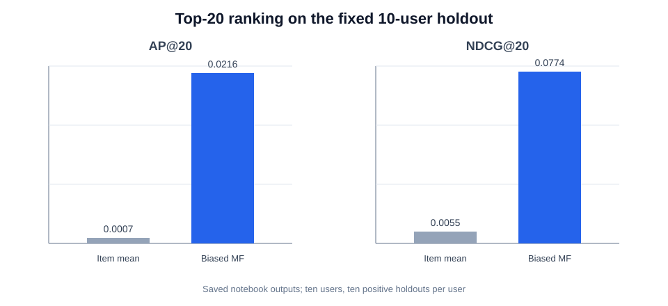
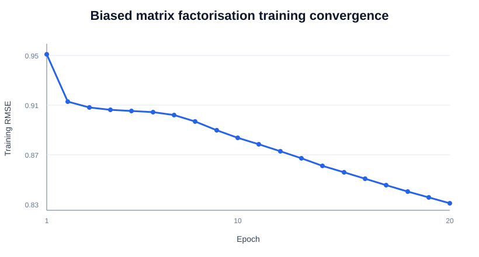

# Movie Recommendation Engine

Python · Recommender Systems · Collaborative Filtering · Matrix Factorisation

## Overview

This individual data science project investigates movie recommendation on the MovieLens 1M dataset. It implements neighbourhood-based collaborative filtering, a genre-aware item-similarity model, and biased matrix factorisation trained with stochastic gradient descent (SGD).

The project contains three experiments:

1. user-based rating prediction with cosine, Pearson, and mean-squared-difference similarities;
2. item-based rating prediction combining adjusted rating similarity with genre Jaccard similarity; and
3. Top-20 ranking with a biased matrix-factorisation model compared with an item-mean baseline.

This repository is a portfolio showcase based on an individual coursework project. Course materials, the original submission, and the MovieLens dataset are not included.

## Dataset

The experiments use MovieLens 1M:

| Property | Verified value |
| --- | ---: |
| Ratings | 1,000,209 |
| Users | 6,040 |
| Movies in metadata | 3,883 |
| Movies with at least one rating | 3,706 |
| Rating scale | 1–5 whole stars |

Movie metadata supplies titles and pipe-separated genres. The dataset is not committed because the accompanying licence prohibits redistribution without separate permission. See [data/README.md](data/README.md) for the official source and local setup.

## Methods

### User-based collaborative filtering

For one reproducibly sampled user with at least 50 ratings, similarities to all other users were calculated over co-rated movies. The implementation compared raw-rating cosine similarity, Pearson similarity, and `1 / (1 + MSD)`. Predictions used the top-k positive-similarity neighbours, with item-mean fallback.

### Item-based and genre-aware similarity

For one reproducibly sampled target movie with at least 500 ratings, rating similarity was computed as cosine similarity between user-mean-centred item vectors, requiring at least ten co-raters. Genre similarity used Jaccard similarity. The hybrid score was:

`similarity = alpha × positive_rating_similarity + (1 - alpha) × genre_similarity`

### Biased matrix factorisation

The ranking experiment used the model:

`r_hat(u, i) = global_mean + user_bias(u) + item_bias(i) + P(u) · Q(i)`

User and item factors, together with both bias terms, were trained from scratch with shuffled SGD and L2 regularisation. The recorded run used 32 latent factors, 20 epochs, learning rate 0.01, regularisation 0.05, and seed 42.

## Evaluation

The Top-20 result is based on a small, fixed evaluation split:

- ten users were sampled without replacement from users with more than 100 ratings;
- ten records per sampled user were held out, preferentially from ratings of at least four stars;
- the remaining 1,000,109 ratings formed the training set;
- all movies not seen in training were candidates, including the held-out items;
- relevance was binary membership in the ten held-out items;
- results were averaged over the ten sampled users using AP@20 and NDCG@20.

This is an offline demonstration, not a general estimate of production performance. The user- and item-neighbourhood RMSE experiments are reported separately because their evaluated ratings also contributed to similarity construction and therefore are not clean out-of-sample tests. Full details are in [docs/evaluation.md](docs/evaluation.md).

## Results

### Top-20 ranking experiment

| Method | AP@20 | NDCG@20 |
| --- | ---: | ---: |
| Item-mean baseline | 0.0007 | 0.0055 |
| Biased matrix factorisation | 0.0216 | 0.0774 |

The matrix-factorisation model achieved NDCG@20 of 0.0774 on this specific evaluation split, compared with 0.0055 for the item-mean baseline. The unrounded ratio is approximately 14.07× the baseline NDCG@20 on this split; it is not a claim of 14× overall recommender quality.

### Exploratory rating-prediction experiments

| Experiment | Best recorded configuration | RMSE | Scope |
| --- | --- | ---: | --- |
| User-based kNN | Pearson, k=10 | 0.6389 | One sampled user; 384 rated movies |
| Item-only similarity | Rating similarity, k=10 | 0.9248 | One target movie; 980 raters |
| Genre-aware hybrid | alpha=0.75, k=10 | 0.9717 | Same target movie and raters |

These RMSE values are descriptive diagnostics only because the experiments do not use a clean holdout.





## Key Findings

- Biased matrix factorisation ranked held-out items above the item-mean baseline on the selected ten-user split.
- In the target-movie experiment, adding genre similarity did not beat rating-only similarity; the best true hybrid setting recorded RMSE 0.9717 versus 0.9248 for rating-only similarity.
- Pearson similarity gave the lowest recorded user-kNN RMSE, but that diagnostic is in-sample and should not be treated as generalisation performance.
- Evaluation design materially changes what can be concluded from recommender metrics.

## Technical Highlights

- Three user-similarity measures implemented with NumPy rather than a recommender library.
- Mean-centred item similarity and genre-set Jaccard similarity combined in a tunable hybrid.
- Biased latent-factor matrix factorisation and per-rating SGD implemented from first principles.
- Top-k candidate filtering, item-mean baseline, AP@20, and NDCG@20 implemented directly.
- Reproducible sampling and training order through recorded random seeds.

## Example Recommendation

The saved run includes qualitative Top-20 lists for three sampled users. They are not reproduced here because the original notebook is withheld pending coursework-publication approval. Recommendation examples are qualitative demonstrations and are not evaluation evidence.

## Repository Structure

```text
movie-recommendation-engine/
├── data/                  # Download and local placement instructions
├── docs/                  # Methodology, evaluation, and limitations
├── notebooks/             # Publication-status note; no coursework notebook
├── results/
│   ├── figures/           # README-ready charts from saved outputs
│   ├── metrics.csv
│   └── training_rmse.csv
├── scripts/               # Rebuilds figures from saved, verified results
├── src/                   # Publication-status note for implementation
├── .gitignore
├── LICENSE-NOTE.md
└── requirements.txt
```

## Reproducing the Figures

After creating a virtual environment and installing the dependencies:

```bash
python -m pip install -r requirements.txt
python scripts/generate_figures.py
```

The full model experiments are not yet independently runnable from this public-safe repository because the assessment implementation has intentionally not been copied. See [src/README.md](src/README.md).

## Limitations

- The ranking comparison covers only ten sampled users and one fixed holdout.
- Held-out relevance is defined as membership in selected rating records, not from online behaviour or explicit recommendation feedback.
- The two neighbourhood RMSE experiments contain evaluation leakage and are exploratory only.
- Results are offline MovieLens experiments; there is no deployment or A/B test.

See [docs/limitations.md](docs/limitations.md) for the complete discussion.

## Publication and Licence Status

This repository contains original portfolio documentation and derived aggregate results only. It does not grant rights to MovieLens data or third-party/course materials. Before publishing implementation code, confirm the course's assessment-publication policy and authorship of every retained cell. See [LICENSE-NOTE.md](LICENSE-NOTE.md).
